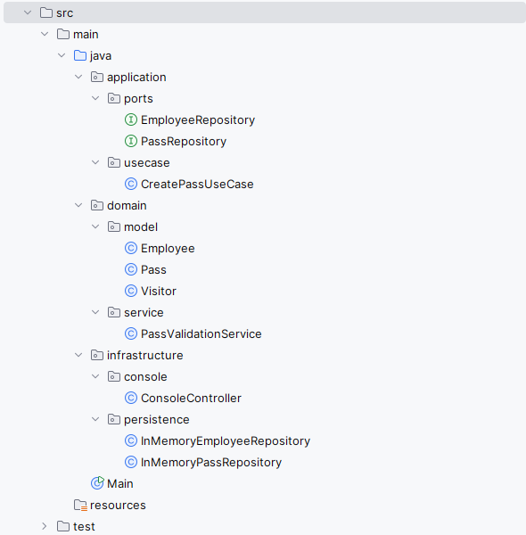
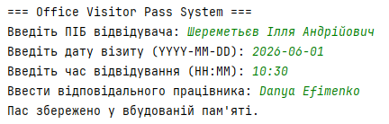
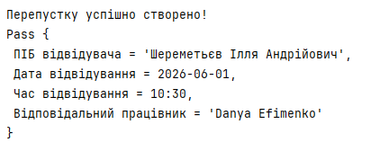
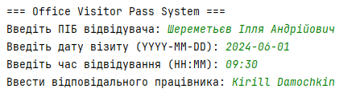
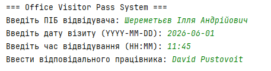
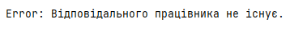
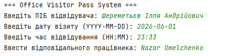
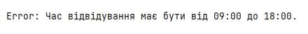
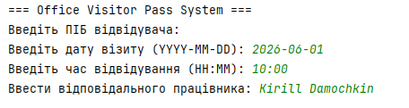
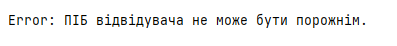

# Office Visitor Pass System

## Опис проєкту

Office Visitor Pass System — це консольна Java-програма для створення перепусток відвідувачам офісу.

Система дозволяє:
- створювати перепустку для відвідувача;
- перевіряти дату та час відвідування;
- перевіряти наявність відповідальної особи;
- зберігати створені перепустки у пам’яті.

---

# Реалізований use case

## Створення перепустки для відвідувача офісу
Користувач вводить:
- ПІБ відвідувача;
- дату відвідування;
- час відвідування;
- відповідальну особу.

Після цього система:
1. Користувач вводить дані відвідувача.
2. Система перевіряє коректність даних:
   - чи дата не є минулою;
   - чи час входить у робочий графік;
   - чи існує відповідальна особа.
3. Якщо всі перевірки успішні — створюється перепустка.
4. Перепустка зберігається у системі.

---

# Обрана архітектура

У проєкті використано:
- Hexagonal Architecture
- Ports and Adapters

---

# Чому була обрана саме ця архітектура

Hexagonal Architecture дозволяє чітко відокремити бізнес-логіку від технічної реалізації.

Основна перевага такого підходу полягає у тому, що:
- бізнес-логіка не залежить від UI;
- бізнес-логіка не залежить від способу збереження даних;
- систему легко розширювати;
- можна змінювати адаптери без зміни ядра системи.

Також архітектура Ports and Adapters дозволяє використовувати інтерфейси для взаємодії між шарами системи.

---

# Структура проєкту

```text
src
 ├── main
 │     └── java
 │          ├── application
 │          │      ├── ports
 │          │      └── usecase
 │          │
 │          ├── domain
 │          │      ├── model
 │          │      └── service
 │          │
 │          ├── infrastructure
 │          │      ├── console
 │          │      └── persistence
 │          │
 │          └── Main.java
 │
 └── test
```



---

# Розподіл відповідальностей

## Domain

Містить основну бізнес-логіку та моделі системи.

### Файли:
- `Pass.java`
- `Visitor.java`
- `Employee.java`
- `PassValidationService.java`

---

## Application

Містить сценарії використання (use cases) та порти.

### Файли:
- `CreatePassUseCase.java`
- `PassRepository.java`
- `EmployeeRepository.java`

---

## Infrastructure

Містить технічні реалізації адаптерів.

### Файли:
- `InMemoryPassRepository.java`
- `InMemoryEmployeeRepository.java`
- `ConsoleController.java`

---

# Де знаходиться бізнес-логіка

Основна бізнес-логіка знаходиться у:

```text
domain/service/PassValidationService.java
```

Там реалізовані перевірки:
- неможливо створити перепустку на минулу дату;
- час відвідування повинен бути у межах робочого дня;
- відповідальна особа повинна існувати у системі;
- ПІБ відвідувача не може бути порожнім.

---

# Використані порти та адаптери

## Ports (інтерфейси)

```text
PassRepository
EmployeeRepository
```

Вони визначають спосіб взаємодії системи із зовнішнім середовищем.

---

## Adapters (реалізації)

```text
InMemoryPassRepository
InMemoryEmployeeRepository
ConsoleController
```

Adapters реалізують технічну поведінку системи:
- роботу з пам’яттю;
- взаємодію з користувачем через консоль.

---

## Використані технології

- Java
- Console Application
- Object-Oriented Programming (OOP)

---

# Приклади роботи програми

Нижче наведено декілька прикладів роботи системи створення перепусток.

---

# 1. Успішне створення перепустки



## Опис

Користувач вводить коректні дані:
- правильну дату;
- правильний час;
- існуючу відповідальну особу.

Система успішно створює перепустку та зберігає її у пам’яті.

---

## Результат



---

# 2. Помилка: дата у минулому



## Опис

Система не дозволяє створити перепустку, якщо дата відвідування знаходиться у минулому.

---

## Результат


---

# 3. Помилка: неіснуючий співробітник



## Опис

Система перевіряє наявність відповідальної особи у сховищі співробітників.

Якщо співробітник не існує — перепустка не створюється.

---

## Результат



---

# 4. Помилка: час поза робочими годинами



## Опис

Система дозволяє створювати перепустки лише у межах робочого часу офісу.

Допустимий час:
- від 09:00
- до 18:00

---

## Результат



---

# 5. Помилка: порожнє ПІБ відвідувача



## Опис

Система не дозволяє створити перепустку без ПІБ відвідувача.

---

## Результат



---

# Інструкція запуску

## Необхідні умови

- Java 17+
- IntelliJ IDEA
- Maven

---

## Запуск
1. Клонувати репозиторій:
```bashgit clone <repository-link>```
2. Відкрити проєкт в IntelliJ IDEA.
3. Запустити файл:
```textMain.java```
1. Клонувати репозиторій:

```bash
git clone https://github.com/your-username/your-repository.git
```

2. Відкрити проєкт у IDE.

3. Запустити файл:

```bash
Main.java
```

---

## Висновок

У ході виконання лабораторної роботи було реалізовано систему створення перепусток із використанням принципів сучасної архітектури програмного забезпечення.

Було продемонстровано:
- відокремлення бізнес-логіки;
- використання портів та адаптерів;
- розподіл відповідальностей між шарами системи;
- реалізацію use case відповідно до принципів Hexagonal Architecture.
